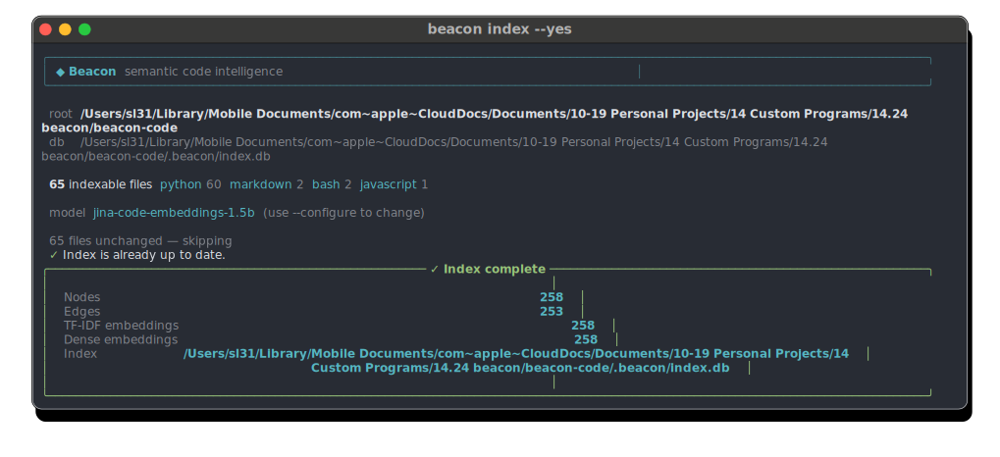
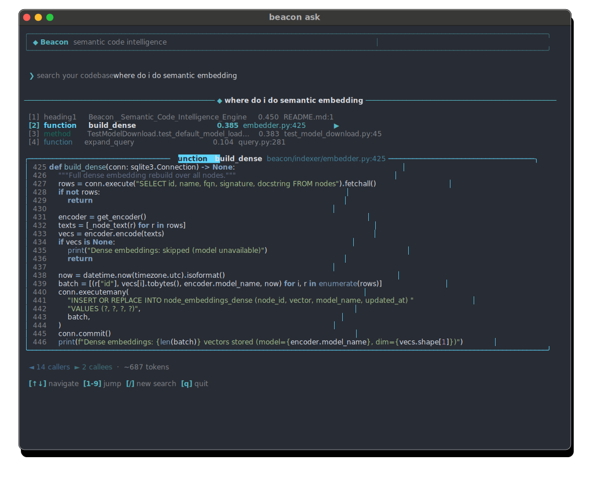

# Beacon — Semantic Code Intelligence Engine

Beacon indexes your codebase with semantic understanding, enabling powerful search, context capsules, and MCP integration for AI assistants.

## Features

- **Semantic Search**: Find code by meaning, not just keywords
- **Context Capsules**: Generate concise, relevant context windows for AI agents
- **Call Graph & Impact Analysis**: Visualize dependencies and understand blast radius
- **Incremental Indexing**: Automatically re‑index only changed files
- **Multi‑Language Support**: Python, JavaScript/TypeScript, Go, Rust, Java, C/C++, Bash, Lua, Swift, R, Markdown, and more
- **MCP Server**: Built‑in Model Context Protocol server for AI coding assistants

## Benchmark: Token Savings vs. Grep

Beacon's core promise is that an AI agent can answer code questions with one structured tool call instead of many grep + file-read operations. We measured this on Django (~380k LOC, 42,622 indexed nodes) using 10 representative queries that span keyword lookups, semantic paraphrases, cross-subsystem traversals, and import graph queries.

| # | Query type | Beacon tokens | Baseline tokens | % Saved | Recall |
|---|---|---|---|---|---|
| 1 | keyword_easy | 1,697 | 3,942 | 57% | ✓ |
| 2 | semantic_paraphrase | 1,533 | 15,514 | 90% | ✓ |
| 3 | multi_hop_call_chain | 1,682 | 24,400 | 93% | ✓ |
| 4 | cross_subsystem | 921 | 23,290 | 96% | ✓ |
| 5 | graph_traversal_callers | 1,744 | 3,942 | 57% | ✓ |
| 6 | semantic_no_obvious_keyword | 1,413 | 12,162 | 88% | ✓ |
| 7 | execution_path | 1,620 | 13,385 | 88% | ✓ |
| 8 | needle_in_haystack | 1,105 | 16,501 | 93% | ✓ |
| 9 | import_graph_query | 2,219 | 16,658 | 87% | ✓ |
| 10 | multi_module_feature | 2,300 | 25,770 | 91% | ✓ |
| **Total** | | **17,234** | **155,564** | **89%** | **10/10** |

**89% fewer tokens** overall (17,234 beacon vs 155,564 baseline), with a 10.5× average savings ratio and 10/10 recall. Beacon found the right code for every query.

**Methodology:** Baseline simulates what an AI agent does without Beacon — `grep -rl` for relevant keywords across all `.py` files, then reads the top 3 matching files in full. Beacon uses one `get_context_capsule` call with an 8,000-token budget. Token counts use a `chars/4` approximation (standard BPE estimate for code). Run the benchmark yourself:

```bash
beacon run-benchmark --root ~/repos/django
```

## Quick Start

```bash
# Install Beacon via uv
uv tool install git+https://github.com/seanlaidlaw/beacon

# Setup hooks for automatic indexing
beacon setup

# Index your codebase
beacon index

# Now either:
# - Run Claude Code (auto-starts beacon mcp)
# - Or search manually with semantic search
beacon ask
```


## Screenshots

### `beacon setup`
`beacon setup` - Install project‑local hook and generate MCP configuration


### `beacon index`

`beacon index` - Scan and index a codebase



### `beacon ask`

`beacon ask` - Interactive TUI for exploring code



### `beacon search`

`beacon search <query>` - Hybrid semantic + keyword search


## Other Commands

- `beacon capsule <query>` - Generate a context capsule for AI agents

- `beacon run-benchmark [--root <dir>]` - Measure token savings vs grep baseline on 10 representative queries

- `beacon mcp` - Start the MCP server for integration with AI assistants

Beacon provides a Model Context Protocol server that lets AI assistants like Claude Code search your codebase, retrieve context capsules, and understand code relationships—all in real time.
This command is run automatically when you start Claude Code, after running
`beacon setup`.


